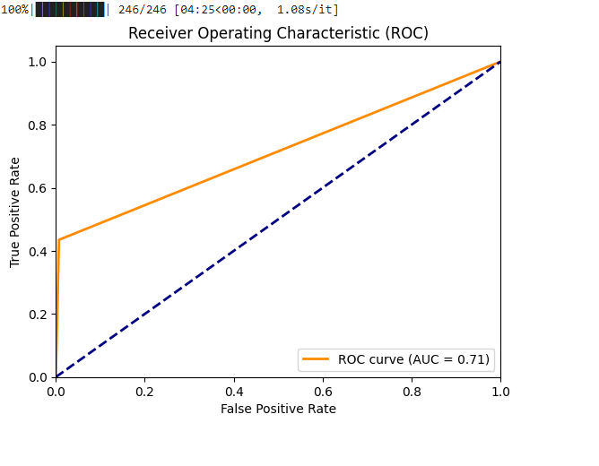

# Resume-Classifier-IC
📄 Welcome to My Resume Classifier Repository 📄

This work presents a resume-classifier ML model which can categorize resumes from a input directory containing pdf files of resumes. I used "Blurr" to train the model and the script.py file can be run directly from the commandline terminal to get the output. 

 ## Data Collection

Data was collected from the link: https://www.kaggle.com/datasets/snehaanbhawal/resume-dataset  

In a tottal, there are 3447 data in the file named as Resume.csv.  

## Model Selection

I used Fastai and Blurr with "distilroberta-base" model as it it easier to use and time effiecient. 

## Model Training
 
Finetuned a `distilrobera-base` model from HuggingFace Transformers using Fastai and Blurr. The model training notebook can be viewed from the "notebook" folder of this repository. The model achieved an accuracy of approximately 96%.

As the size of the dataset was small in this project, it was splitted into 2 sets: train datset and validation dataset. I used the validation dataset for the test dataset in this model.

## Model's Performance

The F1 scores of this model are:

F1 Score (Micro) = 0.5473145780051151
 
F1 Score (Macro) = 0.37185516078339154
 

ROC curve and AUC score: 
 

## Model Compression and ONNX Inference

The trained model has a memory of 300+MB. I compressed this model using ONNX quantization and brought it under 80MB. 

## Model Deployment and Running the Script from CMD terminal:

For model deplyoment, please use the script.py file. This Python script is executable from the command line as follows:
python script.py "path/to/dir".  

The script takes a directory containing the resumes to be categorized as input. Using the trained model, the script categorizes each resume.
 
•For each resume, it moves the resume to the respective category folder.
 
• The script also creates and writes a CSV file named as categorized_resumes.csv containing two columns: filename and category.
